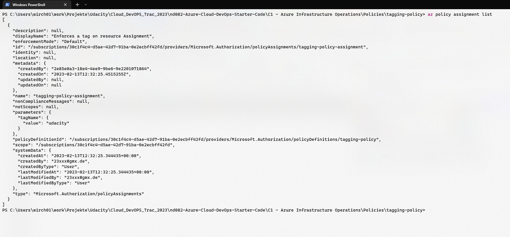
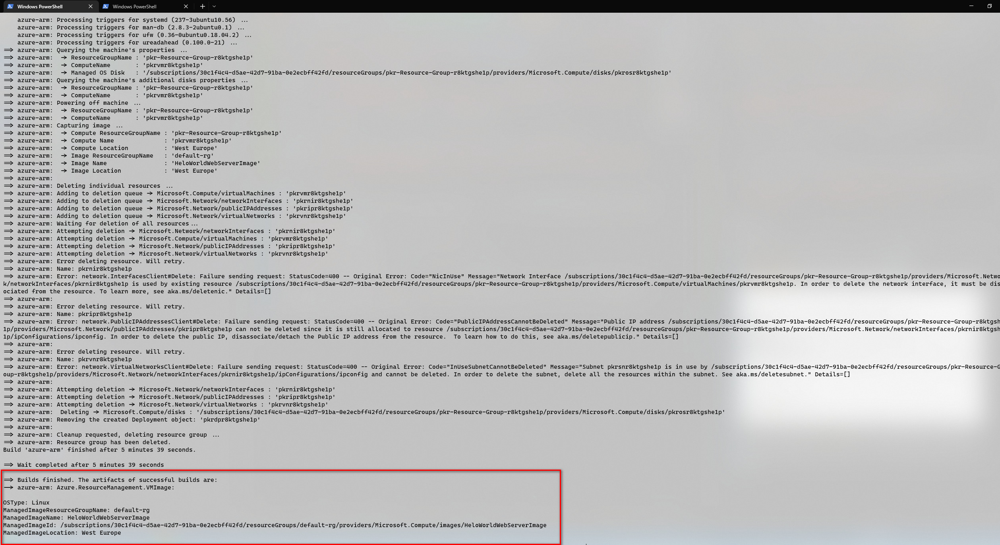
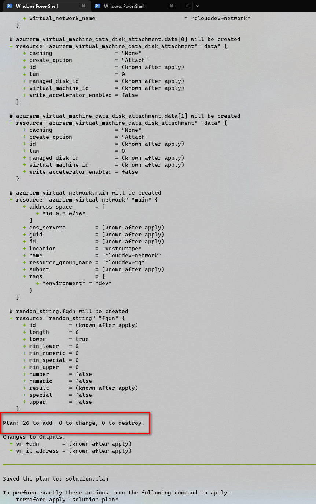
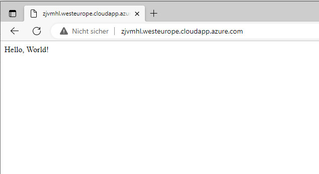

# Azure Infrastructure Operations Project: Deploying a scalable IaaS web server in Azure

## Introduction
This project contains a sample of a scalable "Helo World" web application running in a virtual machine, which is built by a Packer template and provisioned by a Terraform template in Azure Cloud . The scaling of application deployment is customazable and can be configured in varibles file of Terraform.

## Getting Started
An Azure account is neccessary for this project. This can ve easily created on [Azure Account](https://portal.azure.com). It is also advisable to install [Azure command line interface](https://docs.microsoft.com/en-us/cli/azure/install-azure-cli?view=azure-cli-latest) locally.

Some prerequisites need to be created and configured or at least queried  in Azure at first. You have to replace contained placeholders in the square brackets with appropriate values.
1. Run az group create to create a resource group to hold the Packer image.
```bash
az group create -n <resource_group_name> -l <location>
```
2. Run az ad sp create-for-rbac to enable Packer to authenticate to Azure using a service principal. **Key points:** Make note of the output values (appId, client_secret, tenant_id).
```bash
az ad sp create-for-rbac --role Contributor --scopes /subscriptions/<subscription_id> --query "{ client_id: appId, client_secret: password, tenant_id: tenant }"
```
3. Run az account show to display the current Azure subscription Id.
```bash
az account show --query "{ subscription_id: id }"
```
4. For easy of management of all resources beiing created by Terraform we enforces tagging for all resources of a resource group utilizing security policy in Azure. You can enforce additinally a similar rule for resource groups too, just use another rule document `azurepolicy.rules-rg.json` instead.
```bash
az policy definition create --name tagging-policy --display-name "Enforces a tag on resource" --description "Enforces existence of a tag on resources." --rules .\azurepolicy.rules.json --mode Indexed --metadata category=Tags

az policy assignment create --name 'tagging-policy-assignment' --display-name "Enforces a tag on resource Assignment" --scope /subscriptions/<subscription_id> --policy /subscriptions/<subscription_id>/providers/Microsoft.Authorization/policyDefinitions/tagging-policy
``` 
 > A successfull assignment of policies can be checked by `az policy assignment list`. It should look like 

For execution of Packer and Terraform you will also need both applicaiton installed locally. Please refer to Dependencies section for download of installation packages.
## Dependencies
* Install [Packer](https://www.packer.io/downloads)
* Install [Terraform](https://www.terraform.io/downloads.html)

## Instructions
### Customization 
Prior to the execution of `Packer` and `Terraform` templates you might do configuration of following parameters.
 >   server.json
 - *managed_image_resource_group_name*:  
    - name of resource group you previously created,
 - *managed_image_name*: 
    - name of the VM image
 - *location*:  
    - your nearest location. List of Azure location literals can be requested by `az account list-locations --query "[?not_null(metadata.latitude)] .{RegionName:regionalDisplayName}" --output table)`

> var.tf
- *prefix*:  
    - prefix for consistent naming of all resources to be created for easier identification
 - *location*: 
    - the same as in `server.json`
 - *image_name*:  
    - the same as in `server.json`
 - *image_ressource_group*:
    - the same as in `server.json`
 - *tags*
    - tag for all resources to be created
 - *instance_count*
    - amount of instances of virtual machines to be created and run  
 ### Templates' Execution
 1. Execute `packer init` in the folder where `server.json` resides to initialize Packer.
 2. In the same folder create image with `packer build` command and set values of variables to the ones determnined at the beginning. 
 ```bash
 packer build -var "client_id=<service principal application id>" -var "client_secret=<service principal application secret>" -var "subscription_id=<subscription_id>" server.json
 ```
 If any changes to the image are neccessary afterwards you will need to delete the image in Azure (e.g. `az image delete -n  <name of the VM-image> -g <resource group>`) and then reexecute the latter command.

 3. Execute `terraform init` in the folder where `*.tf` files reside to initialize Terraform.
 4. Create Terraform plan with the next command
 ```bash
 terraform plan -var "client_id=<service principal application id>" -var "client_secret=<service principal application secret>" -var "subscription_id=<subscription_id>" -var "tenant_id=<tenant ID>" -out solution.plan
 ```
 5. After successfull creation of Terraform plan, it can be applied using 
 ```bash
 terraform apply solution.plan
 ```
 6. For the sake of removing provisioned application all instracture elements can be destroyed this way
 ```bash
 terraform destroy -var "client_id=<service principal application id>" -var "client_secret=<service principal application secret>" -var "subscription_id=<subscription_id>" -var "tenant_id=<tenant ID>"
 ```

## Output
To make sure you didn't run into any failures please check there are no errors occured and the operations aren't rolled back.

> For `packer build` execution the output should be like this one:



> For `terraform plan` execution a successful run  looks like this:



> For `terraform apply`execution you are fine, if your output is like this:


> If everything run well, with `terraform output` you can get information abour full qualified domain name (FQDN) and server ip adress, where applicaiton is running. Put either FQDN or ip adress in the browser adress field and send an HTTP Request. The site responds with a Hello World Greeting.

    

